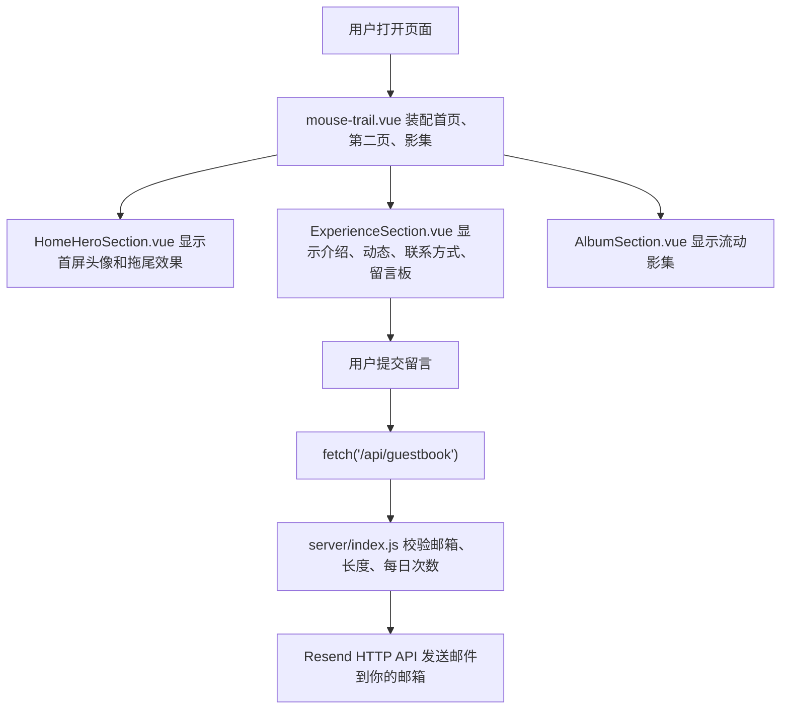

至以前的我，现在的你，人生之路漫漫，自己要一直向前，相信未来美好，贵人明天就到的美好心态，但是可靠的只有自己，要像贵人永远不会来那样坚定努力！
# Bejoy 个人网站

这是一个用 Vue 3 + Vite 做的个人展示网站。页面包含首页鼠标拖尾、第二页个人介绍、技能卡、近期动态、联系方式、留言板，以及流动式影集。留言板通过本地 Express 服务调用 Resend HTTP API，把留言真正发送到邮箱。

更详细的视频介绍请跳转至：（目前还没做出来）

目前只能本地跑，服务器的优化，作者在做了

觉得作者制作用心就点个Star吧！

## 项目结构

```text
CLIENT/
├─ public/
│  ├─ avatar/                 # 首页头像
│  └─ gallery/                # 影集图片和视频
├─ server/
│  └─ index.js                # 留言板发信接口
├─ src/
│  ├─ components/
│  │  └─ MouseTrailEffect.vue # 鼠标拖尾和首屏背景效果
│  └─ views/effects/
│     ├─ mouse-trail.vue      # 页面装配层
│     ├─ content/
│     │  └─ siteContent.js    # 文字、联系方式、影集数据
│     └─ modules/
│        ├─ hero/             # 首页首屏
│        ├─ experience/       # 第二页、联系方式、留言板
│        └─ album/            # 影集流动和弹窗
├─ .env.example               # 环境变量模板
├─ package.json
└─ vite.config.js
```

## 环境准备

需要先安装 Node.js，建议使用 Node 20.19.0 或更新版本。

安装依赖：

```bash
npm install
```

参考 `.env.example`：

```env
RESEND_API_KEY=re_xxxxxxxxx
RESEND_FROM_EMAIL=Portfolio Guestbook <onboarding@resend.dev>
GUESTBOOK_TO_EMAIL=你的邮箱
GUESTBOOK_SERVER_PORT=5177
GUESTBOOK_DAILY_LIMIT=3
GUESTBOOK_MESSAGE_MAX_LENGTH=1200
```

注意：`.env` 里是真实密钥，没有去发邮件的 Resend 注册一个。
同时 `.gitignore` 里保留了 `!.env.example`，示例配置可以上传。

## 运行命令

同时启动前端和后端：

```bash
npm run dev
```

前端页面：

```text
http://127.0.0.1:5176/index.html
```

后端健康检查：

```text
http://127.0.0.1:5177/api/health
```

只启动前端：

```bash
npm run dev:client
```

只启动留言后端：

```bash
npm run dev:server
```

构建检查：

```bash
npm run build
```

响应式检查：

```bash
npm run test:responsive
```

这个命令会用本机 Chrome 自动模拟这些尺寸：

```text
iPhone SE       375 x 667
iPhone 13       390 x 844
Android 大屏    412 x 915
iPad            768 x 1024
笔记本          1366 x 768
桌面宽屏        1920 x 1080
```
其他游览器也有测试，QQ游览器，夸克，基本解决一些兼容性问题

检查内容包括：

- 页面是否能打开
- 首页、第二页、联系方式、留言板、影集是否存在
- 页面是否出现横向溢出
- GitHub、邮箱、微信二维码链接是否正确
- 每个尺寸都会生成一张截图到 `responsive-report/`

`responsive-report/` 是测试产物，已经写进 `.gitignore`。

## 核心流程



## 项目亮点与难点

这个项目不是简单的静态个人页，它可以在简历里包装成一个“个人展示 + 交互式作品集 + 留言转邮件系统”的完整小型前后端项目。

### 亮点

- **原创鼠标拖尾**：灵感来源于海边发光藻类，后面单独介绍！
- **完整个人展示闭环**：首页负责第一印象，第二页展示经历、技能、联系方式，影集展示个人故事，留言板负责访客反馈。
- **组件化工程结构**：把首页、第二页、影集、内容配置拆到不同 Vue 文件和配置文件里，避免所有代码堆在一个页面里。
- **数据驱动内容管理**：文字、联系方式、近期动态、影集数据集中放在 `siteContent.js`，以后改内容不用翻模板和样式。
- **高级动效体验**：首页有鼠标拖尾、首屏渐隐、慢速滚动；影集有左右双向流动、悬停暂停、点击弹窗、键盘切换、`Ctrl + 鼠标滚轮` 缩放和右键拖动画面查看细节。
- **真实后端能力**：留言板不是假按钮，而是通过 Express 接口调用 Resend HTTP API，把访客留言发送到邮箱。
- **安全与稳定性处理**：留言接口做了必填校验、邮箱校验、长度限制、每日次数限制、HTML 转义、JSON 请求体大小限制。
- **响应式自动化测试**：新增 `npm run test:responsive`，自动模拟手机、平板、电脑尺寸，检查模块是否存在、链接是否正确、是否横向溢出。
- **上线意识**：补齐 `.env.example`、`.gitignore`、`README.md`、`npm audit`、`npm run build`，项目更接近真实开发交付流程。

### 难点

- **滚动动画冲突处理**：页面同时存在全局平滑滚动和首页圆圈自定义慢速滚动。解决方式是在 `slowScrollTo()` 里临时把 `scrollBehavior` 改成 `auto`，避免两套动画互相抢控制权。
- **影集连续流动不露空**：如果只复制一组图片，动画到边界会出现空白。现在把每一排复制 3 份，并用 `originalIndex` 保留真实索引，既能连续滚动，又能正确打开弹窗。
- **弹窗状态管理**：影集弹窗要支持图片、视频、关闭、上一张、下一张、键盘方向键、ESC、缩放和平移，同时关闭时要恢复页面滚动，切换图片时要重置缩放位置。
- **留言发送链路**：前端表单提交到 `/api/guestbook`，后端校验后调用 Resend HTTP API。这里要处理环境变量、接口异常、邮箱回复地址、HTML 邮件安全转义。
- **跨设备适配**：移动端和桌面端布局差异很大，需要用 CSS Grid、`clamp()`、媒体查询和自动测试共同保证不挤压、不横向溢出。
- **部署前质量检查**：构建、安全扫描、响应式测试、资源路径检查都要跑通，避免本地能看、服务器上打不开。

## 简历项目写法

### 简历版

**个人品牌展示网站｜Vue 3 / Vite / Express / Resend**

- 基于 Vue 3 + Vite 独立开发响应式个人展示网站，包含首页动效、经历卡片、联系方式、流动影集和留言板等模块，用于求职展示与个人内容沉淀。
- 将页面拆分为 Hero、Experience、Album 等组件，并把文案、联系方式、近期动态和影集数据抽离到统一配置文件，提升后续维护和扩展效率。
- 实现鼠标拖尾、首页渐隐滚动、双向流动影集、图片/视频弹窗预览、键盘切换、弹窗缩放和平移等交互效果，优化页面视觉表现和浏览体验。
- 使用 Express 封装留言接口，通过 Resend HTTP API 将访客留言发送到邮箱，并加入邮箱校验、字数限制、每日次数限制、HTML 转义和请求体大小限制。
- 编写响应式检查脚本，自动模拟 iPhone、Android、iPad、笔记本、桌面宽屏等尺寸，校验核心模块、联系方式链接和横向溢出问题；项目通过 `npm run build` 和 `npm audit` 检查。

### STAR 版

**S｜Situation 背景**

求职时需要一个比普通简历更立体的个人展示入口，既能给招聘方看技术能力，也能给朋友展示个人经历和照片内容。

**T｜Task 任务**

独立完成一个可部署的个人网站，要求页面有设计感、移动端和电脑端都能正常浏览，并支持访客通过留言板直接把反馈发送到邮箱。

**A｜Action 行动**

使用 Vue 3 + Vite 搭建前端，把页面拆成首页、经历区、影集区等模块；通过 CSS Grid、媒体查询和动效控制实现响应式布局、首屏渐隐、鼠标拖尾和流动影集；使用 Express 编写留言接口，调用 Resend HTTP API 发信，并增加参数校验、限流、HTML 转义等保护；最后补充构建、安全扫描和响应式自动化测试脚本。

**R｜Result 结果**

完成一个具备完整展示链路的个人品牌网站，支持手机、平板、电脑多端访问；留言功能可真实发送到邮箱；项目通过 `npm run build`、`npm audit` 和 6 种常见 viewport 的自动化响应式检查，可作为求职作品和部署上线项目使用。

## 关键代码解读

### 1. 页面装配层

文件：`src/views/effects/mouse-trail.vue`

这个文件负责把三个大模块组装到一起：

```vue
<HomeHeroSection />
<ExperienceSection />
<AlbumSection />
```

它还控制首页向第二页滚动时的渐隐效果：

- `heroProgress`：记录滚动进度
- `heroFadeStyle`：把滚动进度换算成透明度、模糊和位移
- `slowScrollTo()`：点击首页底部圆圈后，用 1800ms 滚到第二页

难点：最先开始删掉单独的动画，但是都用全局动画很丑们。这里既有全局平滑滚动，也有首页圆圈的自定义滚动，所以代码里把 `scrollBehavior` 改成 `auto`，避免两套滚动动画互相打架。这里也可以直接引用Locomotive Scroll库，但是个人觉得项目简单，引用增加前端开销，相册那就开销大了，犯不上用。

### 2. 内容配置

文件：`src/views/effects/content/siteContent.js`

这里是自己改文字的地方：

- `experienceCopy`：第二页主要文案
- `skillItems`：技能标签
- `recentItems`：近期动态
- `contactLinkItems`：GitHub、邮箱、微信
- `guestbookCopy`：留言板文案
- `albumCopy`：影集标题和说明
- `galleryItems`：每张照片或视频的标题、说明和路径

影集图片路径必须和 `public/gallery/` 里的文件名一致，例如：

```js
{
  title: '正经照片',
  description: '“人的脸上，真的会慢慢长出走过的路。”',
  src: '/gallery/photo-1.jpg'
}
```

联系方式也在 `siteContent.js` 里改：

```js
export const contactLinkItems = [
  {
    label: 'GitHub',
    href: 'https://github.com/Hiworlddai'
  },
  {
    label: '邮箱',
    href: 'mailto:1950279740@qq.com'
  },
  {
    label: '微信',
    value: '点击查看微信二维码',
    href: '/gallery/wechat-qr.png'
  }
];
```

微信二维码图片放这里gallery，记得命名和我本来的一样：

放好后刷新页面，点击微信卡片就会打开二维码图片。GitHub 是外部链接，会新窗口打开；微信二维码是站内图片，会在当前页面打开。现在图片展示资源统一放在 `public/gallery/`，头像这种固定身份资源继续放在 `public/avatar/`。

### 3. 首页模块

文件：`src/views/effects/modules/hero/HomeHeroSection.vue`

这个模块负责首页头像和欢迎语：

- 头像来源：`/public/avatar/profile-photo.jpg`
- 欢迎语：`Welcome, I am chenkanghong`
- 如果头像加载失败，会显示上传提示

### 4. 第二页和留言板

文件：`src/views/effects/modules/experience/ExperienceSection.vue`

这个模块包含：

- 第二页导航
- 顶部介绍卡
- 技能浮动标签
- 近期动态纵向滚动
- 联系方式卡
- 留言板表单

留言板提交逻辑在 `submitGuestbook()`：

1. 读取邮箱和留言
2. 前端先判断是否为空
3. 请求 `/api/guestbook`
4. 根据后端结果显示成功或失败

近期动态滚动条是自定义的：

- 平时隐藏
- 滚动时显示
- 停止 2 秒后淡出

### 5. 影集模块

文件：`src/views/effects/modules/album/AlbumSection.vue`

影集逻辑：

- `galleryItems` 先分成上下两排
- 每排复制 3 份，形成连续流动
- 上排向左，下排向右
- 点击卡片后打开弹窗
- 图片用 ``
- `.mp4` 视频用 `<video>`
- 第三页相册不是首屏立刻加载，而是在首页、第二页加载完成后通过 `requestIdleCallback` 延后挂载
- 相册列表只加载 `public/gallery/thumbs/` 里的压缩缩略图，点击打开弹窗时才加载 `public/gallery/` 里的原图或视频
- 已去掉 JavaScript 全量 eager 预加载，避免一进页面就把所有原图拉下来
- 弹窗里支持按住 `Ctrl` 滚动鼠标滚轮缩放大图，当前缩放范围是 `0.6x` 到 `3x`
- 图片放大到 `1x` 以上后，可以按住鼠标右键拖动画面查看细节；关闭弹窗、切换图片或缩回 `1x` 以下时，会自动回到中心位置

难点：之前复制 2 份，动画滑到边界时会露空；现在复制 3 份，滚动更连续。并且有游览器兼容问题，在本底游览器好好的，但是到其他游览器就出现空缺，目前作者都没搞清楚，改了很多代码，最后一团糟，然后回档兼容性问题就好了。（🤷‍♂️摊手无奈）等我搞清楚再来补充。


### 6. 留言后端

文件：`server/index.js`

后端负责真正发邮件：

- `GET /api/health`：检查服务是否配置好
- `POST /api/guestbook`：接收留言并调用 Resend HTTP API 发邮件

已经做的保护：

- 必填校验
- 邮箱格式校验
- 邮箱长度校验
- 留言长度限制
- 每个访客每天最多 3 封
- JSON 请求体大小限制
- 直接用 Node 内置 `fetch` 调用 Resend HTTP API，少一个第三方 SDK 依赖
- 环境变量数值兜底，避免端口、次数、字数配置写错后变成异常值
- HTML 转义，避免留言内容污染邮件 HTML

当前限流是内存 Map。它适合个人网站本地或单服务器使用；如果以后部署到多台服务器，建议换成 Redis 或数据库。

## 这次继续优化了什么

- 删除了 `resend` SDK 依赖，改成 `fetch('https://api.resend.com/emails')` 直接请求 Resend HTTP API。这样后端逻辑更透明，也消除了原来由 Resend 间接依赖带来的 `npm audit` 告警。
- 升级了 Vite 到 `8.x`、`@vitejs/plugin-vue` 到 `6.x`，并把 Node 要求改成 `>=20.19.0`，避免继续停留在有安全提示的旧开发工具链。
- `npm audit` 现在已经是 0 个漏洞，包括生产依赖和开发依赖。
- 去掉了第二页介绍卡里的 `v-html`。现在“留言板”链接通过普通 Vue 模板渲染，仍然可以点击跳转，但不会把 HTML 字符串直接注入页面。
- 给留言框加了前端 `maxlength`，和后端 `GUESTBOOK_MESSAGE_MAX_LENGTH` 保持同一个默认值 `1200`。
- 给外部链接补了 `rel="noopener noreferrer"`，新窗口打开时更安全。
- 后端增加了邮箱长度校验，避免异常长的邮箱进入发信流程。
- 后端增加了 JSON 请求体大小限制，减少恶意大请求的影响。
- 后端环境变量改成正整数兜底，端口、每日次数、留言字数写错时会自动回到默认值。
- `package-lock.json` 已同步，别人拉取项目后直接 `npm install` 就能得到一致依赖。
- `.gitignore` 已经补充 `!.env.example`，避免上传 GitHub 时把环境变量模板也误忽略。
- 新增 `npm run test:responsive`，部署前可以自动检查手机、平板、电脑尺寸下的页面结构、联系方式链接和横向溢出问题。
- 相册改成延后挂载，并把列表图切换为压缩缩略图：先显示首页和第二页，再加载第三页影集；影集列表只请求小图，点开弹窗时才请求原图或视频。
- 删除相册的全量 eager 预加载逻辑，服务器不再因为一次访问就同时传输大量原图。
- 相册弹窗新增 `Ctrl + 鼠标滚轮` 缩放，并支持放大后按住鼠标右键拖动画面查看细节；底部操作提示文字已删除，弹窗视觉更干净。


## 当前我检查到并处理的问题

- 修复了留言按钮发送中状态的乱码。
- 给留言接口增加了邮箱格式校验。
- 给留言接口增加了留言长度限制。
- 给 Express JSON 请求体增加了大小限制。
- 去掉了 `v-html`，把介绍卡里的留言板链接改成普通模板渲染。
- 给留言接口增加了邮箱长度校验和错误请求兜底。
- 删除 Resend SDK，改成更轻的 HTTP API 调用。
- 给外部链接补充了 `noopener`。
- 把 Vite、Vue 插件、concurrently 放到 `devDependencies`。
- 增加了 `start` 命令，方便单独启动后端。
- 升级了 Vite 相关开发依赖，安全扫描已经清零。
- 补充了这份 README，方便学习和上传 GitHub。
- 修正 `.gitignore`，保证 `.env.example` 可以作为配置模板上传，真实 `.env` 仍然不会上传。
- 生成的响应式测试截图和 Chrome 临时缓存已经加入 `.gitignore`，保持 GitHub 仓库干净。
- 优化相册加载策略：第三页影集延后挂载，列表使用压缩缩略图，原图和视频只在弹窗打开时加载，首屏和服务器带宽压力更轻。

## 仍然建议以后优化的地方

- 影集原图体积有几张较大；当前列表已经使用缩略图，还可以继续把原图压缩成 WebP，提高点开大图时的加载速度。
- 现在留言限流存在内存里，服务重启后计数会清空；怕丢失数据的可以换成 Redis。
- 如果要把网站部署到 Vercel/Netlify，后端接口需要改成对应平台的 serverless function。我是直接买的服务器，所以限制少一些。
